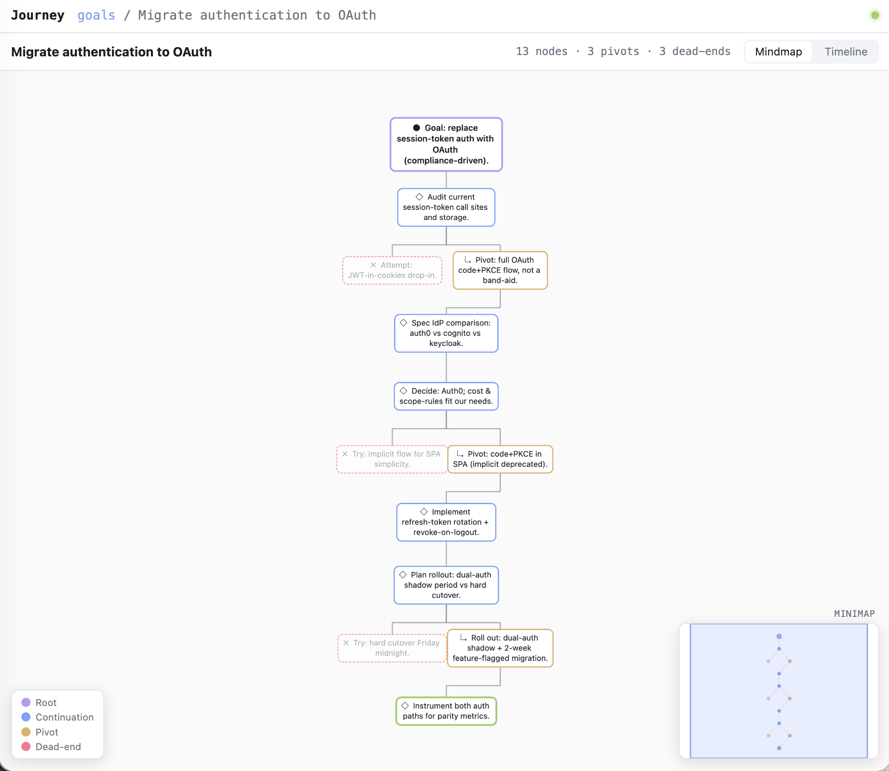
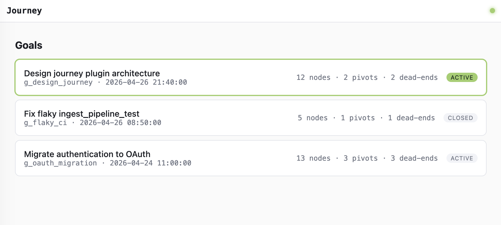
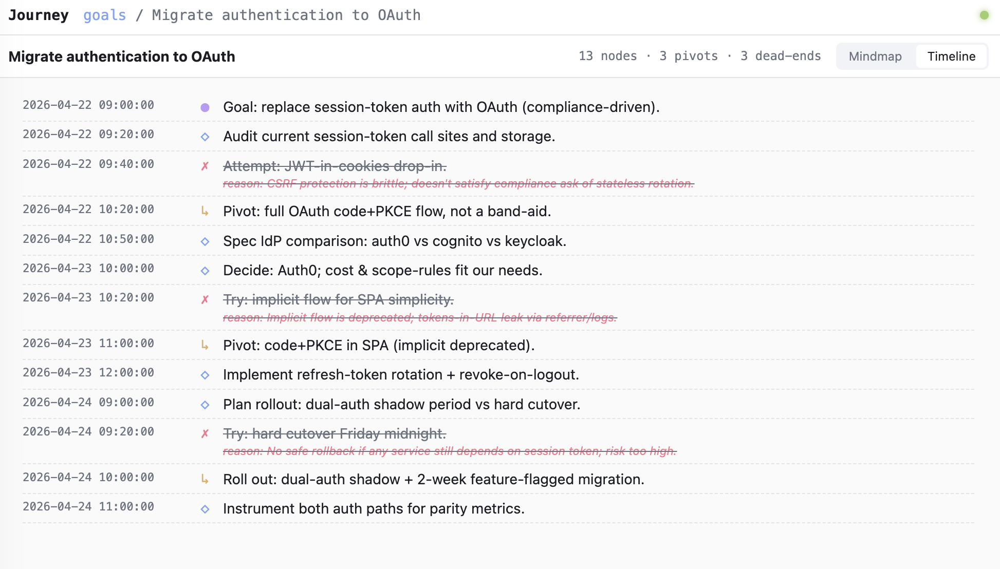

# Journey

A Claude Code plugin that captures every prompt as a node in a **tree of conversation states** — so you can see how your thinking evolved, where you pivoted, and which branches you abandoned.

Anchored to **goals** (not sessions), so a journey can span many conversations, projects, and days.



> ✨ **Status:** v0.4 — works end-to-end. Install from the GitHub marketplace below.

## Why

Long Claude Code sessions are linear scrollback. You lose:
- *Why* you redirected three turns ago.
- *What* you tried before the current approach (and why it didn't work).
- The shape of your own thinking — where you're focused, where you're flailing.

Journey captures this automatically as a **mindmap + timeline** of your conversation, with branches for pivots and dead-ends marked with the reason they were abandoned.

## What it does

- **Capture is fully automated.** Every user turn becomes one node in a per-goal tree. Zero friction, no slash commands to remember.
- **Pivots branch the tree.** Detected via redirection language (`no, instead, switch to, ...`) plus an LLM-assist for soft hints (`hmm, but, actually-soft, alternatively`).
- **Dead-ends auto-explain.** When a pivot fires, the abandoned branch is marked with an inferred reason — captured at zero user cost.
- **Goals span conversations.** Same conversation = same goal. New conversation? A small LLM call asks "does this continue any recent goal?" and matches if so.
- **Lazy LLM summaries.** Each node gets a one-line, ≤20-word summary — generated on demand when you actually look at it, then cached.
- **Two views, same data.**
  - **Browser** (default): `/journey:open` starts a local web UI with a Cytoscape mindmap, draggable minimap, timeline tab, click-to-detail, and live SSE updates.
  - **Terminal**: `/journey:mindmap`, `/journey:timeline`, `/journey:back [N]`, `/journey:goals` for quick at-a-glance views without leaving the CLI.

## Install

### From GitHub (recommended)

In Claude Code, run:

```
/plugin marketplace add vamshisuram/claude-journey
/plugin install journey@claude-journey
/reload-plugins
```

That's it — three commands. After `/reload-plugins`, hooks and slash commands are live: every prompt you send is captured, and `/journey-serve` opens the browser view.

> Canonical docs: https://code.claude.com/docs/en/discover-plugins and https://code.claude.com/docs/en/plugin-marketplaces

### From a local clone (for development)

```sh
git clone https://github.com/vamshisuram/claude-journey ~/code/claude-journey
```

Then in Claude Code:

```
/plugin marketplace add ~/code/claude-journey
/plugin install journey@claude-journey
/reload-plugins
```

Edits to the cloned repo become live after another `/reload-plugins`.

### Uninstall

```
/plugin uninstall journey@claude-journey
/plugin marketplace remove claude-journey
```

Your captured journeys remain on disk (under the plugin's data dir) until you delete them manually.

## Configuration

All optional — sane defaults out of the box.

| Variable / arg | What it does | Default |
|---|---|---|
| `CLAUDE_PLUGIN_DATA` | Where journeys are stored | Auto-set by Claude Code per plugin |
| `JOURNEY_PORT` | Browser-UI port | `7777` |
| `ANTHROPIC_API_KEY` | If set, LLM calls go via API (fast). Otherwise falls back to the `claude` CLI (uses your existing Claude Code auth). | unset |

Slash commands accept `KEY=VALUE` overrides:

```
/journey:open CLAUDE_PLUGIN_DATA=/tmp/some-other-data JOURNEY_PORT=8080
```

## Privacy

- **All data stays on your machine.** Captured prompts, the goal tree, and per-node summaries are written to `${CLAUDE_PLUGIN_DATA}` — the plugin never phones home.
- **LLM calls are opt-in.** Goal titling, lazy summaries, soft-pivot classification, and cross-conversation matching all need an LLM. Two ways to enable:
  - **Anthropic API** — set `ANTHROPIC_API_KEY`. Each call is a small Haiku request (typically <100 tokens out).
  - **`claude` CLI** — if no API key is set, the plugin falls back to spawning `claude -p`, which reuses your existing Claude Code auth.
- **No LLM available?** The plugin still works — it just falls back to heuristics (regex pivot detection, first-15-words summaries, untitled goals) and prints nothing if calls fail. Hooks never break a turn on LLM errors.
- **Stored content includes the first ~200 chars of each prompt.** Full transcripts are *not* duplicated — the plugin keeps a pointer to Claude Code's transcript and reads from it on demand.

## Performance / cost notes

- **Per-turn capture is near-zero overhead** (write a JSON node + maybe a regex test).
- **First turn of a brand-new goal** triggers up to two LLM calls — one for cross-conversation matching, one for the goal title — so it can add 1–3 s to that single turn. Every subsequent turn skips both.
- **Soft-pivot LLM-assist** only fires on turns containing hint words (`but`, `however`, `actually`, `hmm`, `alternatively`, …). Most turns stay regex-only at zero LLM cost.
- **Summaries are lazy.** Tokens are spent only on nodes you actually open in a view. Each summary is cached on disk after first generation.

## Slash commands

All commands are namespaced under `journey:` after install.

| Command | What it does |
|---|---|
| `/journey:open` | **Open the web UI** (mindmap, timeline, goals all live in the browser at http://localhost:7777) |
| `/journey:stop` | Stop the local web UI |
| `/journey:goals` | Terminal: list all known goals (active marked `*`) |
| `/journey:mindmap` | Terminal: ASCII mindmap of the active goal |
| `/journey:timeline` | Terminal: chronological list of all turns in the active goal |
| `/journey:back [N]` | Terminal: last N turns (defaults to 5) — "what did I tell you N pings ago" |

All commands accept `KEY=VALUE` overrides, e.g.:

```
/journey:open CLAUDE_PLUGIN_DATA=/tmp/journey-demo JOURNEY_PORT=8080
```

## Browser UI

Run `/journey:open` (or `node lib/server-control.mjs start` for local dev), then open http://localhost:7777.

### Homepage — every goal you've worked on

Most-recently-active goal is highlighted at the top. One card per goal with node count, pivot count, and dead-end count at a glance.



### Goal view — interactive mindmap

Each turn is a kind-coded bubble: **root** (purple), **continuation** (blue), **pivot** (orange), **dead-end** (faded red, dashed), and the live frontier glows green. Click a node for kind / time / pivot signal / dead-end reason / prompt preview. Drag the minimap viewport to pan, click outside it to jump.


### Timeline — same nodes, chronological

Useful for "when did we pivot" and "what happened today." Dead-ends are line-through with the reason inline.



Live updates: SSE pushes from the file watcher → all open views re-render when new turns are captured.

## Try it without Claude Code (demo data)

```sh
git clone https://github.com/vamshisuram/claude-journey
cd claude-journey

# Seed three realistic goals (30 nodes total, branches and dead-ends)
node scripts/seed-demo.mjs CLAUDE_PLUGIN_DATA=/tmp/journey-demo

# Start the server
node lib/server-control.mjs start CLAUDE_PLUGIN_DATA=/tmp/journey-demo

# Open http://localhost:7777
```

Stop with `node lib/server-control.mjs stop CLAUDE_PLUGIN_DATA=/tmp/journey-demo`.

## How it stores data

Per Claude Code conventions, under `${CLAUDE_PLUGIN_DATA}`:

```
${CLAUDE_PLUGIN_DATA}/
├── index.json                  # global registry of all goals
├── goals/
│   └── g_<id>/
│       ├── tree.json           # nodes for this goal
│       └── meta.json           # goal title, status, timestamps
└── server.log                  # browser-UI server logs
```

Each node looks like:

```jsonc
{
  "id": "n_abc123",
  "parent_id": "n_def456",
  "conversation_id": "session_xyz",
  "timestamp": "2026-04-27T08:32:00Z",
  "kind": "root | continuation | pivot | deadend",
  "pivot_signal": "redirection | alternative | llm_inferred | null",
  "raw_meta": { "user_prompt_preview": "...", "transcript_pointer": {...} },
  "summary": "One-line ≤20-word summary, lazily filled.",
  "deadend_reason": "Why the branch was abandoned (filled when pivoted-from)."
}
```

Source of truth is the JSON tree on disk. Terminal renderer, browser server, and Mermaid export are all sibling read-only views over the same store.

## Repo layout

```
claude-journey/
├── .claude-plugin/plugin.json   # plugin manifest
├── DISCUSSION.md                # design rationale (the conversation that shaped this)
├── hooks/
│   ├── hooks.json               # registers UserPromptSubmit → capture.mjs
│   └── capture.mjs              # per-turn capture
├── commands/                    # slash command definitions
├── lib/
│   ├── store.mjs                # JSON tree read/write
│   ├── detect.mjs               # regex + LLM-assist pivot detection
│   ├── llm.mjs                  # Claude caller (API + CLI fallback)
│   ├── render.mjs               # terminal ASCII renderer
│   ├── server-control.mjs       # start/stop/status for the browser UI
│   └── args.mjs                 # KEY=VALUE positional arg parser
├── server/
│   ├── server.mjs               # Node/Bun HTTP server + SSE
│   └── public/                  # vanilla HTML/CSS/JS + Cytoscape
└── scripts/
    └── seed-demo.mjs            # seed three demo goals
```

## Status

v0.4 — capture, classification, summaries, titles, cross-conversation matching, terminal views, browser UI with mindmap + timeline + minimap. Stable enough to use daily.

Open enhancement ideas:
- Click-node-shows-real-transcript-turn (today shows prompt preview only).
- `Stop` hook to also capture assistant tool usage and files touched.
- Cross-goal pattern surfacing ("you redirect most often when specs are vague").

## License

MIT.
